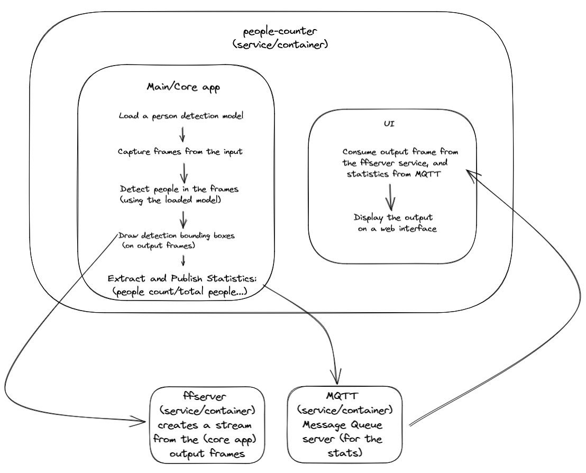
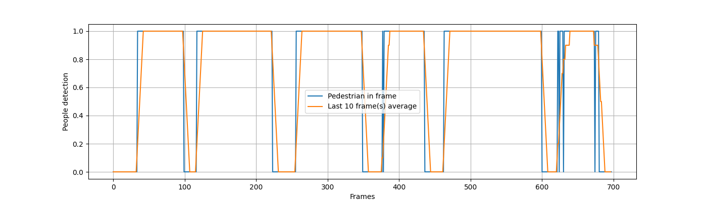

# People Counter App at the Edge

| Details            |              |
|-----------------------|---------------|
| Programming Language: |  Python 3.8 |


## Table of contents

1. [What it does](#what-it-does)
2. [How it Works](#how-it-works)
3. [Requirements](#requirements)<br>
&nbsp;&nbsp;3.1 [Hardware](#hardware)<br>
&nbsp;&nbsp;3.2 [Software](#software)<br>
4. [Run the application](#run-the-application)<br>

## What it Does

The people counter application demonstrates how to create a smart video IoT solution using Intel® hardware and software tools. It detects people in a designated area, providing the number of people in the frame, the average duration of people in the frame, and a total count.

## How it Works

The counter uses the Inference Engine included in the Intel® Distribution of OpenVINO™ Toolkit. The model used should be able to identify people in a video frame. The app should count the number of people in the current frame, the duration that a person is in the frame (time elapsed between entering and exiting a frame) and the total count of people. It then sends the data to a local web server using the Paho MQTT Python package.


(A voting scenario when only one person should be in the frame)



## Requirements

### Hardware

* 6th to 10th generation Intel® Core™ processor with Iris® Pro graphics or Intel® HD Graphics.
* OR use of Intel® Neural Compute Stick 2 (NCS2)

### Software

This implementation is dockerized (self-contained) with multiple services/components:

1. **people-counter** service containing the core and UI services:
    1. A core application/command that processes the input video frame by frame, detects the person and publishes the statistics to MQTT and the output frames to **ffserver**
    2. a react-based **UI** (people-counter/ui) to demo all the components in action (also the service entry point for the people-counter service/container
2. **MQTT** service/container allowing both mqtt and websocket protocols (used by the **UI**)
3. **ffserver** service (with `ffmpeg-3.4.11`: a version still supporting/containing ffserver) for streaming the people-counter output-frame augmented with the detected boxes, and other statistics

(todo add docker-compose sections)

## Model downloads (or build)

### Already converted to Intermediate representation

The project provides a convenient way providing a helper to download the models passing a `model.txt` (intel OpenVino models names new line separated) ex: `./scripts/download_models.sh model.txt`

### Not already converted to IR

It is up to you to decide on what model to use for the application. You need to find a model not already converted to Intermediate Representation format (i.e. not one of the Intel® Pre-Trained Models), convert it, and utilize the converted model in your application.

## Run the application

### Build and start the services

From the main directory:

```bash
docker-compose up
```

or using the Makefile recipe

```bash
make build
```

### Run the application with a specific model.

When all containers are up and running:

1. Access/Open the **UI** by visiting `http://localhost:3000`
2. Start processing the input video: outputs frames with detection to the **ffserver** and statistics to **MQTT** (the UI consuming these two components should reflect that)

```bash
make run-default
```

(Noe that we need to refresh the UI  (reload the page) before each run ex: `make run-default` to re-initialize the total count)

## Handling incorrect detections

To handle incorrect decisions (frames with missing detection/ or false positive ones) and ensure a consistently correct total count we:

 1. First, we used a bit low detection confidence (.85) which increases the recall while filtering and keeping the best detection (this also simulates a non-maxima suppression based on a Jaccard on the detection bounding boxes)
 2. The output detection binary signal is then smoothed by averaging the detection in the last  `n=frames_windows` frames, then we threshold the output again (to get a binary signal).
 3. The binary output signal is then used to determine if a person enters or leaves the scene.



That validates the chosen parameters with a recurrent pattern of 6 persons entering and leaving the scene.
